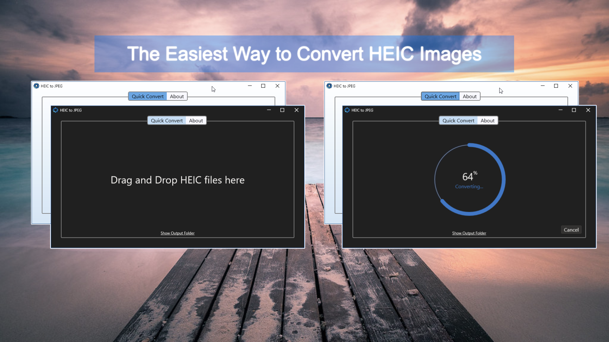

# HEIC-to-JPEG
A suite of software to help convert HEIC photos while protecting privacy by allowing the removal of personal information (HEIC to JPEG Pro). From the no fuss HEIC to JPEG, through to HEIC Converter, there’s something for everyone’s expertise and needs.

This is the official repo for issue tracking, a place where people can report bugs, provide general feedback, and make feature requests.

 - Download HEIC to JPEG [here](https://www.microsoft.com/store/apps/9N83TKCGNLK3)
 - Download HEIC to JPEG **FREE** [here](https://www.microsoft.com/store/apps/9NTVCMPJM5V3)
 - View the Manual [here](https://duckheadsoftware.com/#xl_xr_page_heic_to_jpeg)

# Bugs & New Features

Software is never perfect, there will always be the odd bug or room for improvement, so please report them to us using the issue tracker. We don't want this to be hard, so all we ask is that you include the variant and version of the software you're discussing.

# FAQ

Why not open source the app?

- HEIC to JPEG and it's variants use sub-licensed components with special permission which would not be available to other developers. 

Can I can contribute?

- HEIC to JPEG and its variants are not open source. The best way to contribute is to open an issue or feature request.

If you're not open source, why create this repo?
- The goal of this repo is to provide a method for people to report problems and create feature requests. This is more productive than using Twitter, email, or other methods. 
